# Curses Collection

This is a collection of various curses-based tools and games I have created over the years.
Each tool can be built individually or all of them together by just using the Makefile in the root directory.
Should build on Linux at least, not tested on other platforms.
Check my [homepage/blog](https://kobolt.github.io) for more information.

### Curses Cave Scroller (cavescroll)
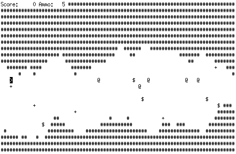

### Old Curses Game (cgame)
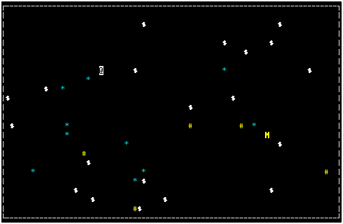

### Directory Tree Diff Front End (difftree)
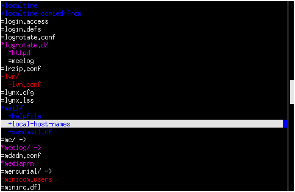

### Simple File Selector in Curses (fileselect)
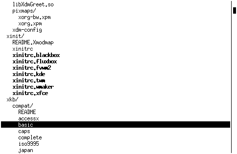

### Curses Invaders (invaders)
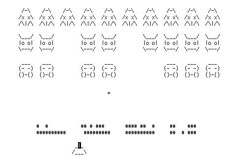

### Mastermind in Curses (mastermind)
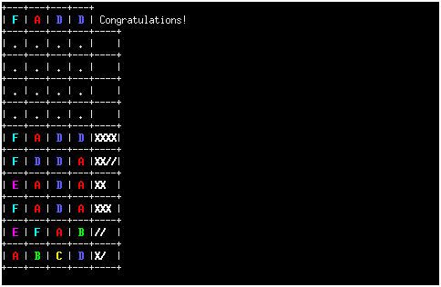

### Simple Curses Menu (menu)
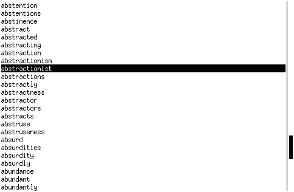

### Playlist Frontend (playlist)
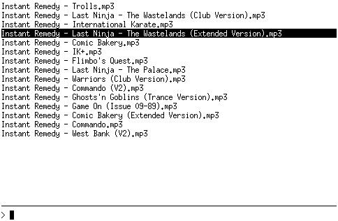

### Substitution Cipher Cryptanalysis (scca)
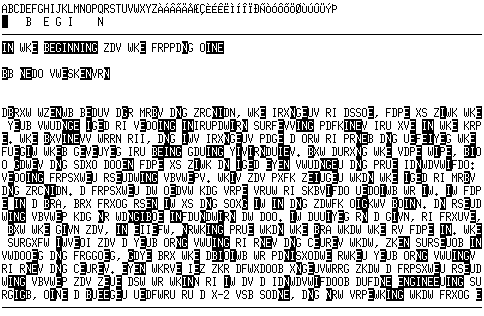

### Snake in Curses (snake)
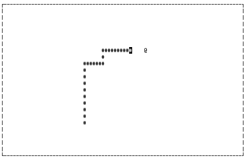

### Curses Snow Crash (snowcrash)
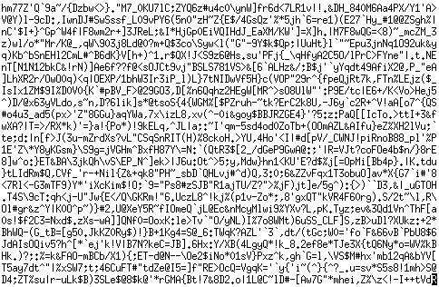

### Storage Chart (storage)
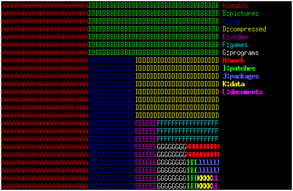

### Sudoku Solver in Curses (sudoku)
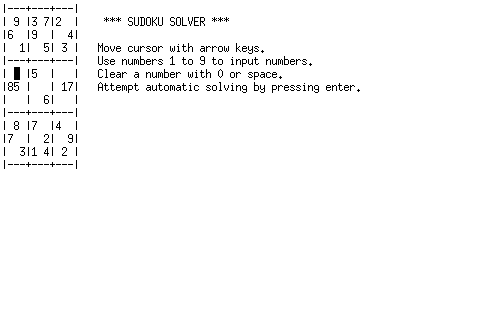

### Racing Game in Curses (racer)
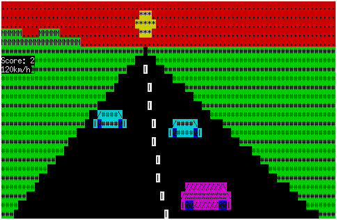

### License

They used to be partially MIT and partially unlicensed, but now everything released together under the MIT license.

